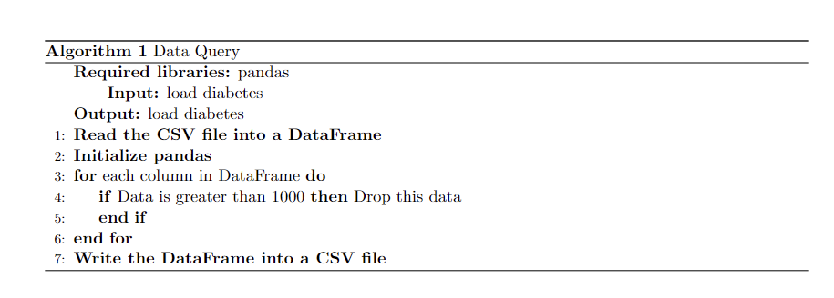
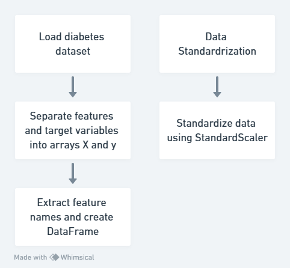

# Code Contents-Data Visualization
In the data visualization section, several steps were taken to explore the characteristics of the diabetes dataset. First, the dataset was loaded using the `load_diabetes()` function from `sklearn.datasets`. Then, the features and target variables were separated into separate arrays called `X` and `y`, respectively. The feature names were also extracted and transformed into a DataFrame for easier analysis.

Next, statistical descriptions of the feature variables and target variable were computed using the `describe()` method on the `y` array and the `corr()` method on the DataFrame, respectively. This provided information such as the number of observations, mean, standard deviation, minimum and maximum values, and quartiles for each variable.

To visualize the distribution of the feature variables, histograms were created using the `hist()` method on the DataFrame. Correlation between the feature variables was also explored using a heatmap generated by the `corrplot()` function from the `seaborn` library.

Finally, the data was standardized using the `StandardScaler` class from `sklearn.preprocessing`. This ensured that all variables had zero mean and unit variance, which is often necessary in machine learning algorithms. Overall, these steps helped to provide an initial understanding of the dataset and its properties.

#### Data Query

#### Data Visualization

Scource: Whimsical
